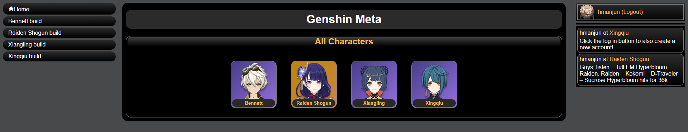

# Genshin Meta

A full stack project that serves data for the game Genshin Impact. Created using React front-end and mongodb backend. Uses graphql to query between the client and server.

Site delivers data for each Genshin character such as simple character info, unique abilities, and optimal builds. 

## Deployed Link

[Deployed Site](https://genshin-meta-t12.herokuapp.com/characters/63172dcc7e85dd2f9c651386)

## Installation

Clone down the repo or download the repo.

Install the required packages by running:
```
npm install
```
This will install both the required packages for the client and server.

Then run the client and server by running:
```
npm start
```

## Aplication Preview



## Technology Used

- Git
- JavaScript
- Node
- Graphql
- Bcrypt
- Dotenv
- MongoDB
- Mongoose
- React
- Apollo Client

## License
[](https://opensource.org/licenses/MIT) 

Licensed under the [MIT](https://opensource.org/licenses/MIT) license

## Questions
Contact me via email at hmanjuna@ucsc.edu
View my other projects on [github](github.com/hmanjun) 